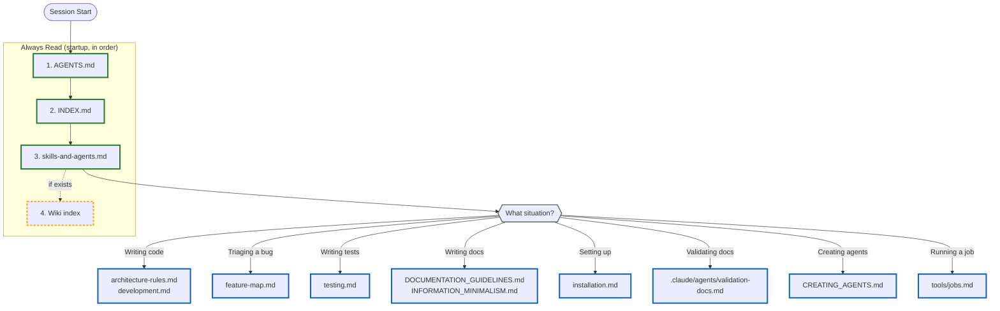

# AI Agent Guidelines

**Audience:** AI coding assistants (LLMs) working on this project

Behavioral instructions and workflow for AI assistants. Fixed standard file — do not edit; project-specific skills and agents are listed in [skills-and-agents.md](skills-and-agents.md).

## MANDATORY READING

**You MUST read the following files BEFORE starting any task:**

- This file (AGENTS.md) - workflow and situational references
- [INDEX.md](INDEX.md) - documentation map
- [skills-and-agents.md](skills-and-agents.md) - available skills and specialized agents
- Wiki index (if exists) - see [wiki.md](wiki.md) for location

## Situational References

Read these **when you reach that situation**, not upfront:

| When you're...          | Read...                       |
|-------------------------|-------------------------------|
| Finding platform docs   | `INDEX.md`                   |
| Setting up / installing | `installation.md`            |
| Writing code            | `architecture-rules.md`, `development.md` |
| Triaging a bug / locating a feature | `feature-map.md` (if it exists) |
| Writing tests           | `testing.md`                 |
| Writing documentation   | `DOCUMENTATION_GUIDELINES.md` |
| Validating docs         | `.claude/agents/validation-docs.md` |
| Testing docs for LLMs   | `.claude/agents/validation-llm.md` |
| Creating skills/agents  | `CREATING_AGENTS.md`          |
| Creating GitHub issues  | `issue-tracker.md`            |
| Running a job           | `tools/jobs.md`               |
| Syncing design ↔ code   | `design-sync.md`              |

**Project-specific situations** (threat model, special test docs, ...) are listed in [project-index.md](project-index.md), if it exists — never add rows to the table above.

**Don't know which doc?** Check [INDEX.md](INDEX.md) for section headers.

How files are loaded — mandatory reads first (sequential), then situational reads on demand:

Green outline = always read | Yellow dashed = read if exists | Blue outline = read when situation occurs

## Before Opening a PR

aiDocs prescribes no development workflow — how work is organised, reviewed, tested and shipped belongs to the project's method stack (listed in [skills-and-agents.md](skills-and-agents.md), if one is installed). Whatever drives the task, these must be true before a PR opens:

- **Discoveries captured** — reusable technical knowledge from the session (API quirks, workarounds, how external systems actually behave) is on the wiki
- **Docs updated** — `changelog.md`, plus docs and wiki per [DOCUMENTATION_GUIDELINES.md](DOCUMENTATION_GUIDELINES.md), with the Information Minimalism test applied
- **Maintenance run** — `/maintain change` ran on the branch diff and its findings are fixed (registry: [tools/jobs.md](tools/jobs.md))

## Skills and Sub-Agents

Two kinds of specialized instructions:

- **Skills** (`.claude/skills/`) — lightweight, auto-triggered or invoked as slash commands
- **Agents** (`.claude/agents/`) — heavy, self-contained tasks with verbose output; each file carries its complete instructions (Claude Code runs them forked; other tools read and follow the file inline)

**Which skill or agent fits the task?** Check [skills-and-agents.md](skills-and-agents.md) — it lists every available skill and agent with its trigger and routes any AI tool to the instruction files.

> **Setup:** See [CREATING_AGENTS.md](CREATING_AGENTS.md) for how to create and register skills and agents.

**Last Updated:** 2026-09-19
